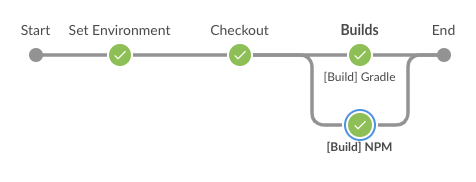

# Learning Jenkins Pipeline
## 여러가지 파이프라인 구성 방법

1. UI를 이용하는 방법
2. 코드(Jenkinsfile)를 이용하는 방법
   - SCM을 이용하는 방법 (추천)
   - SCM 없이 Jenkins에 기입하는 방법 (비추천)


## 내가 생각하는 각각의 장단점

### UI를 이용하는 방법

- 장점
  - 쉽다.
  - 플러그인만 추가하고 UI상으로 설정하면 끝.
  - 가독성이 좋다.
- 단점
  - 프로젝트가 늘어나면 잡이 많아 지는데 뭐 하나 수정하려면 손이 너무 많이 간다. 
    - 설정 -> 수정 -> 저장 .. 반복..ㅠ

### SCM을 통한 Jenkinsfile 을 이용하는 방법

- 장점
  - 전체적으로 수정할 경우 Jenkinsfile 만 수정하고 SCM에 push만 하면 끝

    - IntelliJ 같은 IDE 에서 검색 후 수정 -> 커밋&푸시

  - 병렬처리가 가능

  - 파이프라인을 그래프를 이쁘게 그릴 수 있다.

    
- 단점
  - 러닝커브가 있다.
    - Pipeline 문법을 알아야 한다.
    - `Groovy` 언어를 알아야 한다.
  - 빠르게 잡을 수정할 경우 SCM을 통해 수정해야 한다.

### 결론

- 잡이 몇 개 없다면 UI 이용
- 잡이 많으면 Jenkinsfile 이용


## Jenkinsfile은 두가지 문법

- 두가지 종류

  - **Declarative Pipeline** (이걸로 쓰세요)
    - Blue Ocean 에서 UI로 Jenkinsfile 생성해주는 것도 Declarative 방식
  - **Scripted Pipeline**

- Scripted Pipeline 이 먼저 생겼고 그 후 특정 버전 이후 부터 Declarative Pipeline 이 추가됨


### Declarative Pipeline

```groovy
// 이런 형태
pipeline {
    agent any
    stages ('Example') {
        steps {
            echo "Hello World"
        }
    }
}
```

### Scripted Pipeline

```groovy
// 이런 형태
node {
    stage('Example') {
        if (env.BRANCH_NAME == 'master') {
            echo 'I only execute on the master branch'
        } else {
            echo 'I execute elsewhere'
        }
    }
}
```

#### * 여기에선 Declarative Pipeline을 다뤄 본다.


## Declarative Pipeline - 전체적인 구성

```groovy
pipeline {
    agent {}
    triggers {}
    tools {}
    environment {}
    options {}
    parameters {}
    stages {
        stage('stage1') {}
        stage('stage2') {}
        
        parallel { // 병렬 처리
            stage('parallel_1') {}
            stage('parallel_2') {}
        }
    }
    
    // stages 완료 후 실행
    post {
      always {}
      changed {}
      fixed {}
      regression {}
      aborted {}
      failure {}
      success {}
      unstable {}
      cleanup {}
    }
}
```


## Declarative Pipeline - 전체적인 설정

```groovy
pipeline {
    // ************
    // agent
    // *************
    agent any
    //agent none // 이 경우 stage에서 지정해야 함
    /*
    agent {
      docker {
        image 'maven:3-alpine',
        label 'my-defined-label',
        args '-v /tmp:/tmp'
      }
    }
    */
    /*
    agent {
        dockerfile {
            filename 'Dockerfile.build'
            dir 'build'
            label 'my-defined-label'
            additionalBuildArgs  '--build-arg version=1.0.2'
    	}
    }
    */
    
    // ************
    // triggers
    // *************
    triggers {
        cron('H */4 * * 1-5')
        pollSCM('H */4 * * 1-5')
        upstream(upstreamProjects: 'job1,job2', threshold: hudson.model.Result.SUCCESS)
    }
    
    // ************
    // tools
    // *************
    tools {
      // Jenkins 'Global Tool Configuration' 에 설정한 버전과 연동
      nodejs "node-latest"
      maven 'apache-maven-3.0.1' 
      gradle 'gradle-latest'
    }
    
    // ************
    // environment
    // *************
    environment {
        PROJECT = 'webapp'
        PHASE = params.PHASE // 파라미터값을 받아올 경우
        JOB_NAME = env.JOB_NAME // 내부 변수를 가져올 경우 (https://wiki.jenkins.io/display/JENKINS/Building+a+software+project)
    }
    
    // ************
    // options
    // *************
    options {
        buildDiscarder(logRotator(numToKeepStr: '3', artifactNumToKeepStr: '3'))
      	checkoutToSubdirectory('foo')
      	disableConcurrentBuilds()
        newContainerPerStage
        overrideIndexTriggers(true)
        preserveStashes(5)
        retry(3)
        skipDefaultCheckout()
        skipStagesAfterUnstable()
        timeout(time: 1, unit: 'HOURS')
        timestamps()
    }
    
    // ************
    // parameters
    // *************
    parameters {
        string(name: 'DEPLOY_ENV', defaultValue: 'staging', description: '')
        text(name: 'DEPLOY_TEXT', defaultValue: 'One\nTwo\nThree\n', description: '')
        booleanParam(name: 'DEBUG_BUILD', defaultValue: true, description: '')
        choice(name: 'CHOICES', choices: 'one\ntwo\nthree', description: '')
        file(name: 'FILE', description: 'Some file to upload')
        password(name: 'PASSWORD', defaultValue: 'SECRET', description: 'A secret password')
    }
    
    stages {
        stage('stage 1') {
            // ************
		    // when
    		// *************
            when {
                branch 'master'
                buildingTag()
                changelog '.*^\\[DEPENDENCY\\] .+$'
                changeset "**/*.js"
                changeRequest()
                environment name: 'DEPLOY_TO', value: 'production'
                equals expected: 2, actual: currentBuild.number
                expression { return params.DEBUG_BUILD }
                tag "release-*"
                tag pattern: "release-\\d+", comparator: "REGEXP"
                not { branch 'master' }
                allOf { branch 'master'; environment name: 'DEPLOY_TO', value: 'production' }
                anyOf { branch 'master'; branch 'staging' }
                anyOf {
                    environment name: 'DEPLOY_TO', value: 'production'
                    environment name: 'DEPLOY_TO', value: 'staging'
                }
        	}
            
            // ************
		    // step
    		// *************
            step {
                echo "Hello ${params.PERSON}"
                echo "Biography: ${params.BIOGRAPHY}"
                echo "Toggle: ${params.TOGGLE}"
                echo "Choice: ${params.CHOICE}"
                echo "Password: ${params.PASSWORD}"
                sh 'echo test..'
            }
        }
        
        parallel {
            stage('NPM Build') {
                steps {
                    sh """
                    	cd ${WORKSPACE}
                    	npm set progress=false
                    	yarn install
                    	yarn run stage
                    """
                }
            }
            stage('Gradle Build') {
                steps {
                    sh "gradle clean build"
                }
            }
        }
    }
    
    // ************
	// post
    // *************
    post {
        always {
            echo 'I will always say Hello again!'
        }
        success {
            archiveArtifacts artifacts: "**"
        }
    }
}
```


## Samples

Build Job 하나 만들어 보자.

```groovy
pipeline {
    agent {
        node {
            label 'BUILD'
        }
    }
    
    environment {
        TYPE = "build"
        PROJECT = "webapp"
        PHASE = "dev"
        GIT_URL = "git@github.com:mcpaint/learning-jenkins-pipeline.git"
        ARTIFACTS = "build/libs/**"
    }
    
    options {
        disableConcurrentBuilds()
        buildDiscarder(logRotator(numToKeepStr: "30", artifactNumToKeepStr: "30"))
        timeout(time: 120, unit: 'MINUTES')
        timestamps()
        ansiColor('xterm')
    }
    
    tools {
        jdk "jdk8-latest"
        nodejs "node-latest"
        gradle "gradle-latest"
    }
    
    stages {
        stage('Set Environment') {
            steps {
                script {
                    if (PHASE == 'dev') {
                        BRANCH = 'develop'
                    } else if (PHASE == 'prod') {
                        BRANCH = 'master'
                    }
                }
            }
        } 
        stage('Checkout') {
            steps {
                git url: "${GIT_URL}", branch: "${BRANCH}", poll: true, changelog: true
            }
        }
        stage('Builds') {
			failFast true
            parallel {
                stage('[Build] NPM') {
                    steps {
                        sh """
                            cd ${WORKSPACE}
                            npm set progress=false
                            yarn install
                            yarn run ${NPM_BUILD_MODE}
                        """
                    }
                }

                stage('[Build] Gradle') {
                    steps {
                        sh "gradle clean build -x test --stacktrace"
                    }
                }
            }
        }
    }
    
    post {
        success {
            archiveArtifacts artifacts: "${ARTIFACTS}"
            slackSend channel: '#ops-room',
                color: 'good',
                message: "The pipeline ${currentBuild.fullDisplayName} completed successfully."
        }
        failure {
            mail to: 'team@example.com',
             subject: "Failed Pipeline: ${currentBuild.fullDisplayName}",
             body: "Something is wrong with ${env.BUILD_URL}"
        }
    }
}
```


